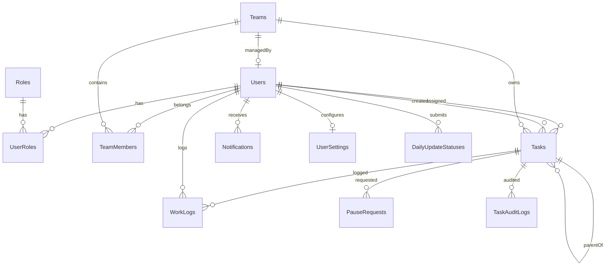

# CogniStruct — Complete System Specification

> **Version**: 1.0 | **Date**: March 2026 | **Type**: Workforce Management & Intelligent Task Orchestration Platform

---

## 1. System Overview

### 1.1 Purpose

CogniStruct is a **workforce management and intelligent task orchestration platform** designed to streamline enterprise task execution through hierarchical project management, workload-aware assignment, and pause governance.

### 1.2 Problem Statement

Organizations struggle with:
- **Unbalanced workloads** — employees burn out while others remain idle
- **Opaque task progress** — managers lack real-time visibility into project health
- **Manual assignment** — task delegation ignores skills, availability, and performance
- **No governance** — pausing/resuming tasks lacks approval workflows and audit trails

### 1.3 Target Users

| User Type | Description |
|---|---|
| **Organizations** | Enterprises managing distributed teams |
| **Admins** | System administrators controlling users, roles, and teams |
| **Managers** | Department heads who create projects and monitor teams |
| **Team Leads** | Leads who decompose projects into subtasks and manage execution |
| **Employees** | Individual contributors executing tasks and logging work |
| **HR** | Human resources staff monitoring org-wide analytics |

### 1.4 Core Capabilities

- Hierarchical task management (Project → Subtask)
- Effort-based workload scoring with 4-component model
- Skill-based intelligent assignment recommendations
- Pause governance with approval workflows
- Real-time project health monitoring
- Consistency-based employee reliability scoring
- Full audit trail for compliance
- Role-based dashboards and access control (5 roles)

### 1.5 Conceptual Flow

```
Manager → Creates Project → Assigns to TeamLead
    TeamLead → Creates Subtasks → Assigns to Employees
        Employee → Executes Subtask → Logs Hours → Completes
    TeamLead → Monitors Progress → Completes Project
Manager → Reviews Analytics → Monitors Health
```

### 1.6 High-Level Architecture

```
┌─────────────────────────────────────────────────────┐
│              React 19 Frontend (Vite 7)             │
│     React Router v7 + Axios + Tailwind CSS          │
│                  Port: 5173                         │
└──────────────────┬──────────────────────────────────┘
                   │  REST/JSON + JWT Bearer Token
┌──────────────────▼──────────────────────────────────┐
│           ASP.NET Core 9.0 Web API                  │
│   14 Controllers + DTOs + Middleware + Services     │
│                  Port: 5000                         │
├─────────────────────────────────────────────────────┤
│        Entity Framework Core 9.0 (Code-First)       │
└──────────────────┬──────────────────────────────────┘
                   │  SQL Queries
┌──────────────────▼──────────────────────────────────┐
│           SQL Server Database (12 Tables)            │
└─────────────────────────────────────────────────────┘
```

---

## 2. System Architecture

### 2.1 Backend Stack

| Technology | Version | Purpose |
|---|---|---|
| ASP.NET Core | 9.0 | Web API framework |
| Entity Framework Core | 9.0 | ORM (Code-First) |
| SQL Server | — | Relational database |
| JWT | — | Authentication & authorization |
| BCrypt.Net | — | Password hashing |
| Swagger/OpenAPI | v1 | API documentation |

### 2.2 Frontend Stack

| Technology | Version | Purpose |
|---|---|---|
| React | 19 | SPA UI framework |
| Vite | 7 | Build tool & dev server |
| React Router | v7 | Client-side routing |
| Axios | — | HTTP client with JWT interceptor |
| Tailwind CSS | — | Utility-first styling |
| Lucide React | — | Icon library |
| React Hot Toast | — | Toast notifications |

### 2.3 Authentication System

1. User submits credentials to `POST /api/auth/login`
2. Backend validates via BCrypt hash comparison
3. JWT access token + refresh token returned
4. Frontend stores token in `localStorage`
5. Axios interceptor attaches `Authorization: Bearer <token>` to every request
6. On 401 → automatic redirect to login

**JWT Claims**: UserId, Email, Roles (multiple roles supported)

### 2.4 API Architecture

- **14 Controllers** with RESTful endpoints
- **Role-based authorization** via `[Authorize(Roles = "...")]`
- **DTOs** for data transfer (no direct entity exposure)
- **JSON camelCase** serialization with null-value omission
- **CORS** configured for frontend origins
- **Swagger UI** available in development mode

### 2.5 Component Interaction

```
Frontend ──HTTP/JSON──▶ Controllers ──▶ AppDbContext ──▶ SQL Server
                            │
                    ┌───────┼───────┐
                    ▼       ▼       ▼
              Workload   Analytics  Audit
              Engine     Module     Logger
```

The **Workload Engine** is embedded in `WorkloadController` and computes scores dynamically on each request. The **Analytics Module** lives in `AnalyticsController`. **Audit logging** is inline within `TasksController` and `PauseRequestsController`.

---

## 3. Data Model

### 3.1 Entity Overview (12 Tables)



### 3.2 Users

| Field | Type | Description |
|---|---|---|
| UserId | int (PK) | Auto-increment |
| FirstName, LastName | nvarchar(100) | Required |
| Email | nvarchar(200) | Unique, used for login |
| PasswordHash | nvarchar | BCrypt hashed |
| IsActive | bit | Soft-delete flag |
| Skills | nvarchar(2000) | Comma-separated skills |
| ManagerId | int (FK→Users) | Reporting manager |
| ProfileImageUrl | nvarchar(500) | Avatar path |

**Additional profile fields**: MiddleName, DisplayName, Gender, DateOfBirth, Nationality, PersonalEmail, MobileNumber, WorkNumber, Bio, JobLove, Interests, JobTitle, WorkerType, TimeType, NoticePeriod, InProbation

### 3.3 TaskItem (Maps to "Tasks" table)

| Field | Type | Description |
|---|---|---|
| TaskId | int (PK) | Auto-increment |
| Title | nvarchar(500) | Required |
| Description | nvarchar(5000) | Detail |
| AssigneeId | int (FK→Users) | Assigned person |
| AssignerId | int (FK→Users) | Creator |
| TeamId | int (FK→Teams) | Team association |
| Priority | int | 0=Low, 1=Medium, 2=High, 3=Critical |
| Status | int | 0=Pending, 1=Assigned, 2=InProgress, 3=Completed, **4=Paused** |
| Deadline | datetime2 | Due date |
| EstimatedHours | float | Estimated effort |
| PausedAt | datetime2 | Set when paused, cleared on resume |
| PauseReason | nvarchar(500) | Reason for pause |
| RequiredSkills | nvarchar(500) | Comma-separated required skills |
| **ParentTaskId** | **int (FK→Tasks)** | **Null = Project, Set = Subtask** |
| SubTasks | Collection | Child tasks (navigation) |

### 3.4 PauseRequest

| Field | Type | Description |
|---|---|---|
| Id | int (PK) | Auto-increment |
| TaskId | int (FK→Tasks) | Task being paused |
| EmployeeId | int (FK→Users) | Affected employee |
| RequestedByUserId | int (FK→Users) | Who requested (system or TeamLead) |
| Reason | nvarchar(500) | Pause reason |
| Status | int | 0=Pending, 1=Approved, 2=Rejected |
| IsSystemGenerated | bit | True if auto-generated by workload escalation |
| ApprovedByUserId | int (FK→Users) | Who approved/rejected |
| ApprovedAt | datetime2 | Resolution timestamp |

### 3.5 TaskAuditLog

| Field | Type | Description |
|---|---|---|
| AuditId | int (PK) | Auto-increment |
| TaskId | int (FK→Tasks) | Audited task |
| PerformedByUserId | int (FK→Users) | Actor |
| Action | nvarchar(50) | e.g. "paused", "resumed", "status_changed" |
| Details | nvarchar(2000) | Context (old/new values, reasons) |
| CreatedDate | datetime2 | Timestamp |

### 3.6 Other Entities

| Entity | Purpose | Key Fields |
|---|---|---|
| **Roles** | 5 system roles | RoleId, RoleName, Description |
| **UserRoles** | Many-to-many join | UserId, RoleId (composite PK) |
| **Teams** | Team grouping | TeamId, TeamName, ManagerId, IsActive |
| **TeamMembers** | Many-to-many join | TeamId, UserId, JoinedDate |
| **WorkLog** | Time entries | WorkLogId, TaskId, UserId, StartTime, EndTime, TotalHours |
| **Notifications** | In-app notifications | NotificationId, UserId, Type, Message, IsRead |
| **DailyUpdateStatus** | Daily check-ins | DailyUpdateId, UserId, UpdateDate, Summary, IsSent |
| **UserSettings** | User preferences | SettingsId, UserId, Theme, TimeZone, notification toggles |

---

## 4. Role-Based Access Control (RBAC)

### 4.1 Roles

| Role | Purpose |
|---|---|
| **Admin** | Full system access — user/team/role management, audit logs, system health |
| **Manager** | Creates projects, manages teams, monitors analytics, approves pauses |
| **TeamLead** | Decomposes projects into subtasks, manages execution, handles pause requests |
| **Employee** | Executes subtasks, logs time, submits daily updates, tracks skills |
| **HR** | Organization-wide people analytics, employee oversight, time log monitoring |

### 4.2 Permission Matrix

| Action | Admin | Manager | TeamLead | Employee | HR |
|---|---|---|---|---|---|
| Create Users | ✅ | ❌ | ❌ | ❌ | ❌ |
| Manage Roles | ✅ | ❌ | ❌ | ❌ | ❌ |
| Create Teams | ✅ | ✅ | ❌ | ❌ | ❌ |
| Delete Teams | ✅ | ❌ | ❌ | ❌ | ❌ |
| Add/Remove Members | ✅ | ✅ | ❌ | ❌ | ❌ |
| Create Projects | ✅ | ✅ | ❌ | ❌ | ❌ |
| Create Subtasks | ❌ | ❌ | ✅ | ❌ | ❌ |
| Update Tasks | ✅ | ✅ | ❌ | ❌ | ❌ |
| Delete Tasks | ✅ | ❌ | ❌ | ❌ | ❌ |
| Update Task Status | ✅ | ✅ | ✅ | ✅ | ❌ |
| Pause/Resume Tasks | ❌ | ✅ | ✅ | ❌ | ❌ |
| Approve Pause Requests | ✅ | ✅ | ✅ | ❌ | ❌ |
| View Workload | ✅ | ✅ | ❌ | ❌ | ✅ |
| View Analytics | ✅ | ✅ | ❌ | ❌ | ✅ |
| View Audit Logs | ✅ | ❌ | ❌ | ❌ | ❌ |
| Log Work Hours | ✅ | ✅ | ✅ | ✅ | ✅ |
| Submit Daily Updates | ❌ | ❌ | ❌ | ✅ | ❌ |
| Acknowledge Updates | ❌ | ✅ | ✅ | ❌ | ❌ |

### 4.3 Page Access

| Page | Admin | Manager | TeamLead | Employee | HR |
|---|---|---|---|---|---|
| Dashboard | `/dashboard` | `/manager/dashboard` | `/teamlead/dashboard` | `/employee/dashboard` | `/hr/dashboard` |
| User Management | ✅ | ❌ | ❌ | ❌ | ❌ |
| Role Management | ✅ | ❌ | ❌ | ❌ | ❌ |
| Team Management | ✅ | ✅ (own teams) | ✅ (own team) | ❌ | ✅ (read-only) |
| Projects/Tasks | ✅ | ✅ (own teams) | ✅ (own projects) | ✅ (own tasks) | ❌ |
| Time Logs | ✅ | ✅ (team-wide) | ✅ (team-wide) | ✅ (personal) | ✅ (org-wide) |
| Workload | ✅ | ✅ | ✅ | ❌ | ✅ |
| Analytics | ✅ | ✅ | ❌ | ❌ | ✅ |
| Audit Logs | ✅ | ❌ | ❌ | ❌ | ❌ |
| Pause Requests | ❌ | ❌ | ✅ | ❌ | ❌ |
| System Health | ✅ | ❌ | ❌ | ❌ | ❌ |
| Employee Insights | ✅ | ❌ | ❌ | ❌ | ❌ |
| Skill Progress | ❌ | ❌ | ❌ | ✅ | ❌ |
| Peer Recognition | ❌ | ❌ | ❌ | ✅ | ❌ |
| Weekly Reflection | ❌ | ❌ | ❌ | ✅ | ❌ |
| Leaderboard | ✅ | ✅ | ✅ | ✅ | ✅ |

---

## 5. Workflow Architecture

### 5.1 Project Creation Workflow

```
1. Manager opens "My Projects" page
2. Selects a team they manage
3. Creates a Project (parent task):
   - Title, Description, Priority, Deadline, EstimatedHours
   - Assigns to a TeamLead (must be team member)
4. System validates:
   - Manager owns the team
   - Assignee is a TeamLead role
   - Assignee belongs to the team
5. Project created with Status=Pending
6. Audit log: "project_created"
7. Notification sent to TeamLead: "You have been assigned a new project"
```

### 5.2 Task Assignment Workflow

```
1. TeamLead opens Project Detail page
2. Creates Subtask under the project:
   - Title, Description, Priority, Deadline, EstimatedHours, RequiredSkills
   - Assigns to an Employee (must be team member)
3. System validates:
   - TeamLead owns the parent project
   - Parent is not completed or paused
   - No sub-subtasks allowed (single level)
   - Assignee belongs to project's team
4. If Priority=Critical → workload escalation check
5. Subtask created with Status=Pending
6. Audit log: "subtask_created"
7. Notification sent to Employee: "You have been assigned a new subtask"
```

### 5.3 Execution Workflow

```
1. Employee sees task on "My Tasks" page
2. Updates status: Pending → InProgress
3. Logs work hours via WorkLog entries (StartTime, EndTime, Description)
4. Updates status as needed
5. Marks task as Completed
6. Audit log: "subtask_completed"
```

### 5.4 Project Completion Workflow

```
1. TeamLead opens Project Detail page
2. Attempts to mark project as Completed
3. System validates:
   - Project has at least one subtask
   - ALL subtasks are Completed
   - TeamLead is the project assignee
4. If valid → Project marked Completed
5. Audit log: "project_completed"
```

### 5.5 Pause Governance Workflow

```
1. System detects workload escalation during Critical task assignment:
   - Employee's projected workload ≥ 80%
2. System auto-generates PauseRequests for up to 3 lower-priority tasks
   - Skips already-paused tasks
   - Skips tasks with existing pending requests
   - Orders by lowest priority first, then farthest deadline
3. PauseRequest created with IsSystemGenerated=true, Status=Pending
4. TeamLead sees pending requests on Pause Requests page
5. TeamLead can:
   - APPROVE → Task is paused (Status=4), audit logged, assignee notified
   - REJECT → Request marked rejected, no task change
```

### 5.6 Manual Pause & Resume

```
PAUSE:
1. TeamLead/Manager clicks Pause on a task
2. System validates: not completed, not already paused
3. Ownership check (TeamLead must own parent project)
4. Task Status → 4 (Paused), PausedAt set, PauseReason stored
5. Audit log + notification to assignee

RESUME:
1. TeamLead/Manager clicks Resume
2. System validates: task is paused, parent is not paused
3. Deadline auto-extended by pause duration (subtasks only)
4. Task Status → 2 (InProgress), PausedAt/PauseReason cleared
5. Audit log + notification with new deadline
```

---

## 6. Task Hierarchy Model

### 6.1 Structure

```
Project (ParentTaskId = null)
├── Subtask 1 (ParentTaskId = ProjectId)
├── Subtask 2 (ParentTaskId = ProjectId)
└── Subtask 3 (ParentTaskId = ProjectId)
```

### 6.2 Rules

| Rule | Enforcement |
|---|---|
| **Single level only** | Sub-subtasks blocked: parent's ParentTaskId must be null |
| **Team inheritance** | Subtasks inherit TeamId from parent |
| **No subtask under completed project** | Blocked if parent Status=3 |
| **No subtask under paused project** | Blocked if parent Status=4 |
| **TeamLead ownership** | TeamLead can only create subtasks under projects assigned to them |
| **Completion requires all subtasks done** | Project cannot complete with incomplete subtasks |
| **Project needs subtasks** | Project cannot complete without at least one subtask |
| **No delete with subtasks** | Project with subtasks cannot be deleted |
| **Pause propagation** | Subtask cannot be completed or resumed while parent is paused |
| **Deadline extension** | Subtask deadline auto-extended by pause duration; project deadline is NOT extended |

---

## 7. Workload Engine

### 7.1 Scoring Model (4 Components, max 100%)

The workload engine computes a single percentage dynamically for each employee.

| Component | Max Weight | Formula |
|---|---|---|
| **A. Effort Score** | 40% | `min(40, (totalEstimatedHours / 40) × 40)` |
| **B. Weekly Work Score** | 30% | `min(30, (weeklyLoggedHours / 40) × 30)` |
| **C. Priority Pressure** | 15% | Sum of `estimatedHours × (priorityMultiplier - 1)` per task, normalized to 15% |
| **D. Deadline Pressure** | 15% | +5 pts per task ≤3 days, +2.5 pts per task ≤7 days |

**Priority Multipliers**: Low=1.0, Medium=1.1, High=1.2, Critical=1.3

**Final Workload** = `min(100, round(A + B + C + D))`

### 7.2 Active Tasks Definition

Only **subtasks** (ParentTaskId ≠ null) with Status ≠ Completed are counted. Parent/project tasks are excluded.

### 7.3 Thresholds

| Range | Label | Assignment Behavior |
|---|---|---|
| 0–29% | Low | Has capacity — recommended |
| 30–59% | Moderate | Can take more — recommended |
| 60–79% | Nearing capacity | Consider carefully |
| 80–89% | High | Assignment not recommended |
| 90–100% | Overloaded | Excluded from recommendations |

### 7.4 Usage

- **Assignment recommendations**: `/api/workload/recommend/{teamId}` ranks team members by projected workload
- **Critical escalation**: When a Critical task would push workload ≥80%, auto-generates PauseRequests for lower-priority tasks

---

## 8. Skill-Based Assignment Engine

### 8.1 Endpoint

`GET /api/workload/recommend/{teamId}?requiredSkills=React,SQL&hours=8`

When `requiredSkills` is provided, the system returns **AssignmentSuggestions** ranked by a composite score.

### 8.2 Scoring Components (max 100)

| Component | Max Score | Formula |
|---|---|---|
| **A. Skill Match** | 40 | `(matchedSkills / requiredSkills) × 40` |
| **B. Availability** | 30 | `(100 - currentWorkload%) × 0.30` |
| **C. Performance** | 20 | `(completedTasks / totalTasks) × 20` |
| **D. Consistency** | 10 | `consistencyRaw × 0.10` |

### 8.3 Skill Matching

- Employee skills are stored as comma-separated string in `Users.Skills`
- Required skills are specified per task in `Tasks.RequiredSkills`
- Case-insensitive comparison
- Match percentage = matched count / required count × 100

### 8.4 Assignment Score

`AssignmentScore = min(100, SkillScore + AvailabilityScore + PerformanceScore + ConsistencyScore)`

### 8.5 Reason Categories

| Condition | Reason |
|---|---|
| Full match | "Full skill match (N/N)" |
| Partial match | "Partial match (X/N skills)" |
| No match | "No skill match — consider for training" |

---

## 9. Consistency Score Module

### 9.1 Purpose

Measures employee **reliability** over the last 30 days based on completed subtasks.

### 9.2 Scoring Components (max 100 raw)

| Component | Max | Formula |
|---|---|---|
| **A. Variance Score** | 40 | `(1 - avgVariance) × 40` where variance = `|actual - estimated| / estimated` |
| **B. Adherence Score** | 40 | `(onTimeCount / totalWithDeadline) × 40` |
| **C. Overdue Score** | 20 | `(1 - overdueCount / totalWithDeadline) × 20` |

### 9.3 Edge Cases

- **< 3 completed tasks in 30 days**: Returns default score of 70 (neutral)
- **No tasks with deadlines**: Adherence defaults to 30, Overdue defaults to 15
- **No work logs**: Actual hours fallback to estimated hours

### 9.4 Influence on Assignment

The raw consistency score (0–100) is scaled to 0–10 and added to the AssignmentScore. Higher consistency = more reliable = better recommendation.

---

## 10. Pause Governance System

### 10.1 Two Pause Mechanisms

| Type | Trigger | Actor |
|---|---|---|
| **Manual Pause** | TeamLead/Manager clicks Pause | TeamLead (own projects) or Manager (override) |
| **System-Generated PauseRequest** | Critical task assignment causes workload ≥80% | System auto-creates, TeamLead approves/rejects |

### 10.2 PauseRequest Workflow

```
Critical Task Assignment
    │
    ▼
Workload ≥ 80%?  ──No──▶ Normal assignment
    │ Yes
    ▼
Select up to 3 lower-priority active tasks
(not already paused, no existing pending request)
    │
    ▼
Create PauseRequests (IsSystemGenerated=true, Status=Pending)
    │
    ▼
TeamLead reviews on Pause Requests page
    │
    ├──▶ APPROVE → Task paused, audit log, notification
    └──▶ REJECT  → Request resolved, task unchanged
```

### 10.3 Pause Effects

| When Paused | Effect |
|---|---|
| Task Status | Set to 4 (Paused) |
| PausedAt | Timestamp recorded |
| PauseReason | Stored |
| Subtask completion | Blocked while parent is paused |
| Subtask creation | Blocked under paused parent |

### 10.4 Resume Effects

| When Resumed | Effect |
|---|---|
| Task Status | Set to 2 (InProgress) |
| PausedAt / PauseReason | Cleared |
| Subtask deadline | Auto-extended by pause duration |
| Project deadline | NOT auto-extended |
| Subtask resume | Blocked if parent is still paused |

---
